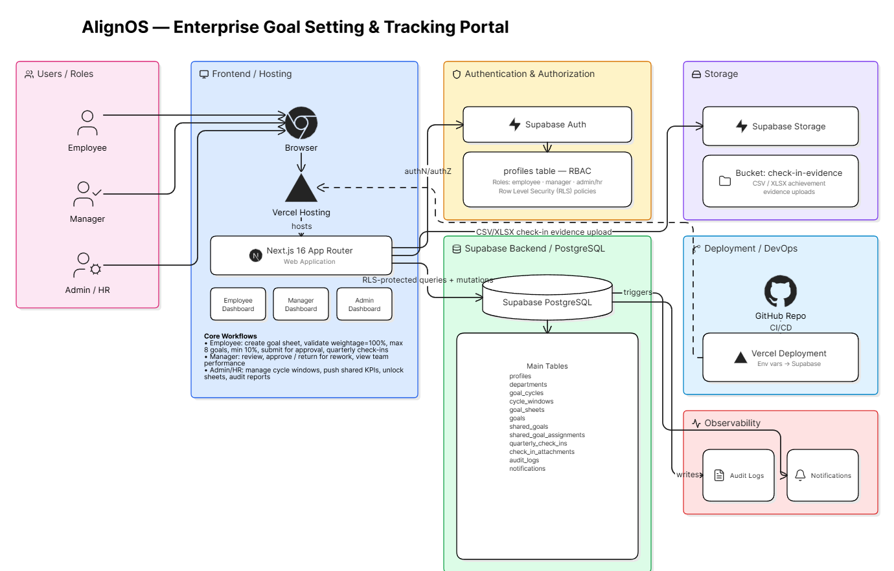

# AlignOS — Enterprise Goal Setting & Tracking Portal

**AlignOS** is a web-based Enterprise Goal Setting and Tracking Portal built for **AtomQuest Hackathon 1.0**. It digitizes the complete organizational goal lifecycle: employee goal creation, manager approval, shared KPI alignment, quarterly achievement check-ins, evidence uploads, audit logs, reporting, and Admin/HR exception handling.

The platform is designed for three core personas: **Employee**, **Manager**, and **Admin/HR**, each with role-specific dashboards and controlled access.

---

## Live Working URL


**Live Demo:** [click this live link](https://syntra-enterprise-goal-alignment-platform-ozvc7uyfg.vercel.app/)


## Source Code

**GitHub Repository:** [Syntra Enterprise Goal Alignment Platform](https://github.com/differentnischal-art/Syntra-Enterprise-Goal-Alignment-Platform)

---

## Demo Credentials

### Admin / HR

| Role | Email | Password |
|---|---|---|
| Admin / HR | `admin@alignos.com` | `Admin@123` |

### Managers

| Manager | Email | Password |
|---|---|---|
| Manager 1 | `manager@alignos.com` | `Manager@123` |
| Manager 2 | `manager2@alignos.com` | `Manager@1234` |

### Employees

| Employee | Email | Password | Assigned Manager |
|---|---|---|---|
| Employee 1 | `employee1@alignos.com` | `Demo@123` | `manager@alignos.com` |
| Employee 2 | `employee2@alignos.com` | `Demo@1234` | `manager@alignos.com` |
| Employee 3 | `employee3@alignos.com` | `Demo@12345` | `manager2@alignos.com` |

---

## Architecture Diagram

The project follows a modern serverless architecture using **Next.js**, **Vercel**, **Supabase Auth**, **Supabase PostgreSQL**, **Supabase Storage**, and **Row Level Security**.



---
---

## Problem Statement Alignment

Many organizations still rely on spreadsheets, offline review cycles, and fragmented email-based goal tracking. This creates poor visibility, weak accountability, delayed manager reviews, and difficulty producing audit-ready appraisal data.

AlignOS solves this by providing a structured digital portal for:

- Creating and validating employee goal sheets
- Submitting goals for manager approval
- Locking goals after approval
- Allowing Admin/HR exception-based unlocks
- Pushing shared departmental KPIs
- Capturing quarterly achievement updates
- Uploading CSV/XLSX evidence for check-ins
- Maintaining audit logs and completion visibility

---

## Core Features

### Employee Experience

Employees can:

- Create and edit goal sheets before submission
- Add thrust area, goal title, description, UoM, target, and weightage
- Submit goal sheets for manager approval
- View locked or approved goals
- Continue rework after Admin unlock
- Submit quarterly check-ins
- Upload CSV/XLSX achievement evidence
- Track goal lifecycle progress

### Manager Experience

Managers can:

- View direct reports
- Review submitted goal sheets
- Approve goals
- Track team goals and performance
- Monitor quarterly check-in completion
- Review planned vs actual achievement
- View team roster and check-in status

### Admin / HR Experience

Admins can:

- Manage cycle windows
- Push shared KPIs to multiple employees
- View organization audit logs
- Monitor escalations and completion status
- Unlock approved or locked goal sheets for exception handling
- Maintain governance across the full goal lifecycle

---

## Hackathon Requirements Covered

### Phase 1 — Goal Creation & Approval

| Requirement | Status |
|---|---|
| Employee goal sheet creation | Implemented |
| Thrust area selection | Implemented |
| UoM selection | Implemented |
| Target and weightage entry | Implemented |
| Total weightage must equal 100% | Implemented |
| Minimum 10% weightage per goal | Implemented |
| Maximum 8 goals per employee | Implemented |
| Manager approval workflow | Implemented |
| Goals locked after approval | Implemented |
| Admin unlock for exception handling | Implemented |
| Shared KPI push to multiple employees | Implemented |

### Phase 2 — Achievement Tracking & Quarterly Check-ins

| Requirement | Status |
|---|---|
| Quarterly actual achievement entry | Implemented |
| Planned vs actual tracking | Implemented |
| Status selection per goal | Implemented |
| System-computed progress score | Implemented |
| Manager check-in visibility | Implemented |
| CSV/XLSX evidence upload | Implemented |
| Cycle window support | Implemented |

### Governance & Reporting

| Requirement | Status |
|---|---|
| Audit trail | Implemented |
| Notifications | Implemented |
| Exportable goal data | Implemented |
| Role-based dashboards | Implemented |
| Supabase RLS-backed access control | Implemented |

---

## Tech Stack

| Layer | Technology |
|---|---|
| Frontend | Next.js 16 App Router |
| Language | TypeScript |
| Styling | Tailwind CSS |
| UI | Custom role-based dashboard components |
| Authentication | Supabase Auth |
| Database | Supabase PostgreSQL |
| Storage | Supabase Storage |
| Authorization | Role-Based Access Control + Row Level Security |
| Hosting | Vercel |
| Version Control | GitHub |

---

## High-Level System Architecture

```text
Users
 ├── Employee
 ├── Manager
 └── Admin / HR
        │
        ▼
Browser
        │
        ▼
Next.js App hosted on Vercel
        │
        ├── Supabase Auth
        │       └── profiles table + role-based access control
        │
        ├── Supabase PostgreSQL
        │       ├── profiles
        │       ├── departments
        │       ├── goal_cycles
        │       ├── cycle_windows
        │       ├── goal_sheets
        │       ├── goals
        │       ├── shared_goals
        │       ├── shared_goal_assignments
        │       ├── quarterly_check_ins
        │       ├── check_in_attachments
        │       ├── audit_logs
        │       └── notifications
        │
        └── Supabase Storage
                └── check-in-evidence bucket
```

---

## Main Database Tables

| Table | Purpose |
|---|---|
| `profiles` | Stores user profile, role, department, and manager mapping |
| `departments` | Stores department information |
| `goal_cycles` | Stores active and historical goal cycles |
| `cycle_windows` | Stores goal-setting and quarterly check-in windows |
| `goal_sheets` | Stores each employee's goal sheet lifecycle |
| `goals` | Stores individual goals within goal sheets |
| `shared_goals` | Stores Admin/Manager-created shared KPIs |
| `shared_goal_assignments` | Links shared KPIs to selected employees |
| `quarterly_check_ins` | Stores quarterly achievement updates |
| `check_in_attachments` | Stores metadata for uploaded CSV/XLSX evidence |
| `audit_logs` | Tracks critical lifecycle and governance actions |
| `notifications` | Stores user-facing system notifications |

---

## Key Workflows

### 1. Employee Goal Creation

```text
Employee Login
 → Create Goal Sheet
 → Add goals, targets, UoM, and weightage
 → System validates rules
 → Submit for Manager Approval
```

### 2. Manager Approval

```text
Manager Login
 → View Pending Approvals
 → Review Employee Goal Sheet
 → Approve Goal Sheet
 → Goals become locked
```

### 3. Admin Exception Handling

```text
Admin Login
 → View approved/locked goal sheets
 → Unlock sheet for rework
 → Employee edits and resubmits
 → Manager reviews again
```

### 4. Quarterly Check-in

```text
Employee Login
 → Open Quarterly Check-in
 → Enter Actual Achievement
 → Select Status
 → Upload CSV/XLSX Evidence
 → Submit Check-in
 → Manager reviews progress
```

### 5. Shared KPI Flow

```text
Admin / Manager creates Shared KPI
 → Selects linked employees
 → Pushes shared goal
 → Employees receive read-only title/target
 → Employees adjust weightage where allowed
```

---

## Goal Validation Rules

| Rule | Validation |
|---|---|
| Total weightage | Must equal 100% |
| Minimum goal weightage | 10% per goal |
| Maximum goals per employee | 8 goals |
| Required fields | Goal title, thrust area, UoM, target, and weightage |
| Locked goals | Cannot be edited after approval unless Admin unlocks |

---

## Progress Score Logic

| UoM Type | Meaning | Formula |
|---|---|---|
| Higher Better | Higher achievement is better | Achievement ÷ Target |
| Lower Better | Lower achievement is better | Target ÷ Achievement |
| Timeline | Date-based completion | Completion date vs deadline |
| Zero Based | Zero means success | If actual is 0, score = 100%; otherwise 0% |

---

## Local Development

### 1. Clone the Repository

```bash
git clone https://github.com/differentnischal-art/Syntra-Enterprise-Goal-Alignment-Platform.git
cd Syntra-Enterprise-Goal-Alignment-Platform
```

### 2. Install Dependencies

```bash
pnpm install
```

### 3. Configure Environment Variables

Create a `.env.local` file:

```env
NEXT_PUBLIC_SUPABASE_URL=your_supabase_project_url
NEXT_PUBLIC_SUPABASE_ANON_KEY=your_supabase_anon_key
```

Do not commit `.env.local`.

### 4. Start Development Server

```bash
pnpm run dev
```

Open:

```text
http://localhost:3000
```

### 5. Build Locally

```bash
pnpm run build
```

---

## Deployment

The app is deployed on **Vercel**.

Recommended deployment settings:

| Setting | Value |
|---|---|
| Framework | Next.js |
| Install Command | `pnpm install` |
| Build Command | `pnpm run build` |
| Output Directory | Next.js default |
| Environment Variables | Supabase URL and anon key |

For judge access, ensure:

- Vercel Production deployment is active
- Deployment Protection is disabled
- Production URL is shared, not a protected preview URL

---

## Submission Checklist

- [ ] Live Vercel demo URL added
- [ ] GitHub repository link added
- [ ] Architecture diagram added
- [ ] Admin credentials verified
- [ ] Manager credentials verified
- [ ] Employee credentials verified
- [ ] Employee journey tested
- [ ] Manager journey tested
- [ ] Admin journey tested
- [ ] Supabase migrations applied
- [ ] Vercel Deployment Protection disabled
- [ ] Final build passes

---

## Project Highlights

- Complete goal creation and approval lifecycle
- Three separate role-based user journeys
- Admin/HR exception handling through goal unlock
- Shared KPI distribution across employees
- Quarterly achievement check-ins with evidence upload
- Audit-ready lifecycle tracking
- Supabase-backed live data
- Vercel-hosted production deployment
- Designed for enterprise goal alignment and governance

---

## Author

**Nischal Adhikari**

Built for **AtomQuest Hackathon 1.0**.

**Project Name:** AlignOS — Enterprise Goal Setting & Tracking Portal  
**Repository:** https://github.com/differentnischal-art/Syntra-Enterprise-Goal-Alignment-Platform  
**Live Demo:** https://syntra-enterprise-goal-alignment-platform-ozvc7uyfg.vercel.app/
